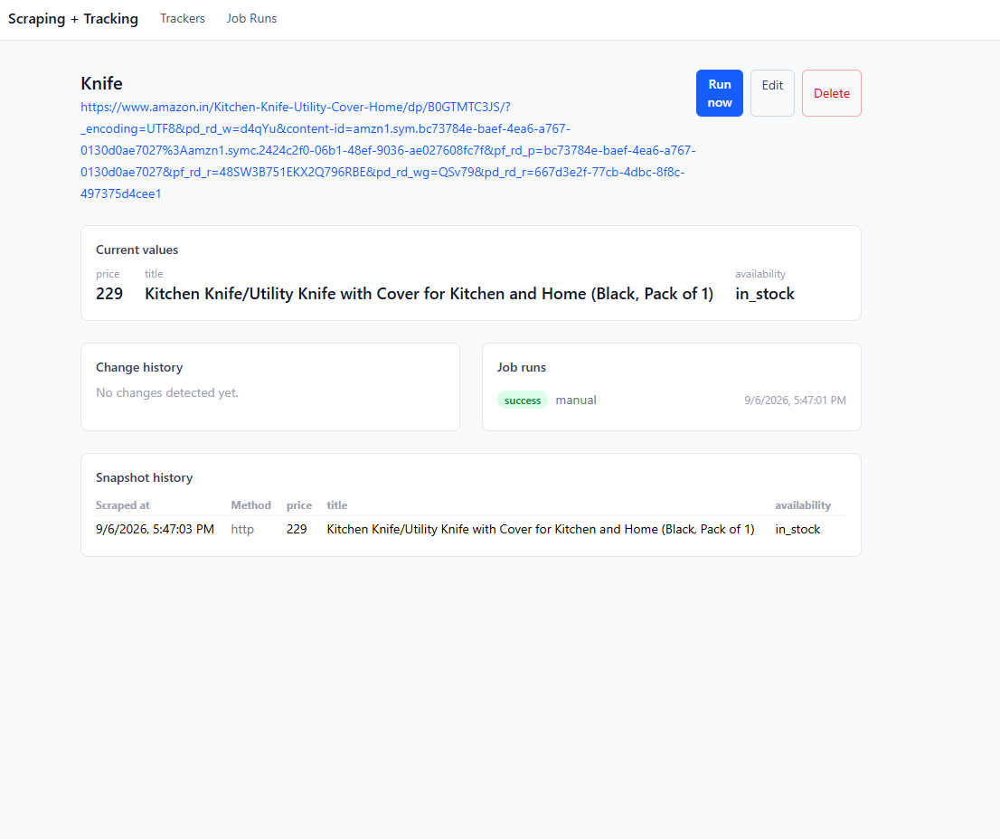

# Scraping + Tracking Platform

Point it at any web page, tell it what to extract (a price, an availability
label, a job status, an article headline — anything you can select with a
CSS selector), and it scrapes that page on a schedule, normalizes and
diffs the result against history, and shows you what changed.

Built entirely on free, open-source tooling — no paid scraping APIs, no
paid LLM services, no paid job queues. Scraping falls back to a
self-hosted, free headless browser (Playwright/Chromium) only for pages
that actually need JavaScript rendering; everything else uses a fast
plain HTTP fetch.

## Architecture

- **Backend**: FastAPI + PostgreSQL + Celery/Redis for background scraping
  jobs.
- **Scraping**: `httpx` + BeautifulSoup first (fast, cheap); automatic
  fallback to Playwright/Chromium (self-hosted, free) only when the
  configured selectors come back empty, or when a tracker is explicitly
  marked as requiring JS.
- **Scheduling**: `celery-beat` ticks a single dispatcher task every
  `DISPATCH_INTERVAL_SECONDS`; the dispatcher queries Postgres for
  trackers whose own `next_run_at` (driven by each tracker's own
  `poll_interval_seconds`) is due, so each tracker can have a different
  interval without a fixed beat schedule per tracker.
- **Change detection**: each scrape is normalized per field type
  (price/number/text/availability) and diffed against the previous
  snapshot; meaningful changes are written to `change_events`, which
  double as the in-app notification feed.
- **Frontend**: React (Vite) + TypeScript + Tailwind CSS — trackers list,
  tracker detail (current values, price history sparkline, change
  history, job runs, snapshot history), create/edit form with a
  CSS-selector field editor and starter templates, and a global job
  status page.

## Prerequisites

- Docker + Docker Compose
- Node.js 18+

No API keys are required.

## Setup

1. **Configure environment variables**

   ```bash
   cp .env.example .env
   ```

   The defaults work out of the box for local use.

2. **Start Postgres, Redis, the API, the Celery worker, and Celery beat**

   ```bash
   docker compose up -d --build
   ```

   The first build downloads Playwright's Chromium binary inside the
   image (~150–300MB), so it's noticeably slower than a typical Python
   image build — subsequent builds are cached.

3. **Run database migrations**

   ```bash
   docker compose run --rm backend alembic upgrade head
   ```

   The API is now live at `http://localhost:8000` (`/docs` for Swagger UI).

4. **Run the frontend**

   ```bash
   cd frontend
   cp .env.example .env   # defaults to http://localhost:8000, edit if needed
   npm install
   npm run dev
   ```

   Open the printed URL (usually `http://localhost:5173`).

## Using it

1. Click **+ New Tracker**, pick a starter template (or leave it blank),
   set the URL and the fields you want to extract (a CSS selector per
   field, with an optional XPath override and a field "type" — `price`,
   `number`, `text`, or `availability` — that controls how values are
   normalized and diffed).
2. Save it. It's scraped immediately and then on its configured
   interval — or click **Run now** any time for an out-of-band check.
3. The tracker's detail page shows current values, a history table, a
   sparkline for numeric fields, the change/diff history, and every job
   run with its status (and error message, if it failed).
4. The **Job Runs** page shows every scrape across all trackers,
   auto-refreshing while anything is pending or running.

## Known limitations (by design, for a demo-scale build)

- **No auth / single implicit owner.** Nothing in the spec called for
  multi-user support; adding it later means mirroring the reference
  project's `core/security.py` + `core/deps.py` pattern, adding a `users`
  table, and scoping trackers by `user_id`.
- **JS-fallback heuristic is all-or-nothing**: it escalates to the
  headless browser only when *every* configured field comes back empty
  on the HTTP pass. A page that's half server-rendered and half
  JS-injected won't trigger the fallback — set `requires_js: true` on
  that tracker explicitly instead.
- **Price/number parsing takes the first number it finds** in the
  extracted text (robust against sites that render a price twice in the
  same element, e.g. Amazon's accessible off-screen price copy) — but
  it isn't locale-aware, so a page using `.` as a thousands separator
  (some European sites) would parse incorrectly.
- **Unscoped wildcard selectors (`[class*='price']` etc.) can match the
  wrong element entirely** on pages with "customers also bought" /
  related-item carousels, which commonly reuse the exact same classes as
  the real product for unrelated items — you'll get a plausible-looking
  but completely wrong, often-changing value instead of an obvious
  failure. There's no generic detection for this; scope the selector to
  a container specific to the real product (see the Amazon Product
  template, which scopes to Amazon's `#ppd` product-page wrapper) rather
  than trusting a wildcard class match on a complex page.
- **Amazon's own page layout isn't consistent** across categories/regions
  — the price container can be `#centerCol` on one listing and `#rightCol`
  on another, and `#availability` doesn't exist at all on some in-stock
  listings. The Amazon Product template scopes broadly to `#ppd` (which
  contains both) to stay correct across layouts, at the cost of not
  always finding availability text that a narrower, listing-specific
  selector would.
- **Price and availability can be flat-out missing on session-gated
  listings like Amazon's, even with correct selectors.** Some listings
  withhold price/stock entirely from a request that has no saved
  delivery address or session cookies — you'll get "Currently
  unavailable" and no price even though the item is in stock and priced
  normally for a real, logged-in browser. This is not a selector or
  parsing bug: the extracted text is exactly what the site's server
  returned. Confirmed this is genuinely session/cookie-gated, not an
  IP-geolocation thing, by checking that a full headless Chromium fetch
  (`requires_js: true`) gets the identical degraded response with zero
  cookies — a real browser only sees the correct address/price because
  that's tied to the signed-in account, not the request itself. There's
  no fix for this within a stateless scraper; it would need a new
  feature to store and replay a real logged-in session's cookies per
  tracker (a meaningfully bigger addition, with real security tradeoffs
  around storing live session credentials), which is out of scope here.
- **Notifications are in-app only.** Change events land in the
  `change_events` table and the dashboard's "Recent changes" feed;
  `app/services/notifier.py` is structured so email/webhook channels can
  be added later as new `NotificationChannel` implementations without
  touching any call sites.
- **No robots.txt / ToS enforcement.** This tool will scrape whatever URL
  you give it — it's on you to only track pages you're allowed to.
- **Beat's fixed tick introduces jitter**: a tracker's actual scrape time
  can drift by up to `DISPATCH_INTERVAL_SECONDS` from its configured
  interval, since due-ness is only checked on each beat tick.
- **The headless fallback is materially slower and heavier** per run
  than the plain HTTP path — expect JS-heavy trackers to take a few
  seconds instead of milliseconds, and to use more worker memory.

## Deployment (not set up, just notes)

Everything here runs locally via Docker Compose. To put it online for
free: frontend on Vercel/Netlify, backend on Render/Fly.io's free web
service tier, Postgres on Neon/Render's free tier, Redis on Upstash's
free tier. Watch memory limits on the Celery worker's free tier — a
headless Chromium instance needs noticeably more RAM than the plain HTTP
path, and very small free-tier containers may struggle with it.


# Scraper



